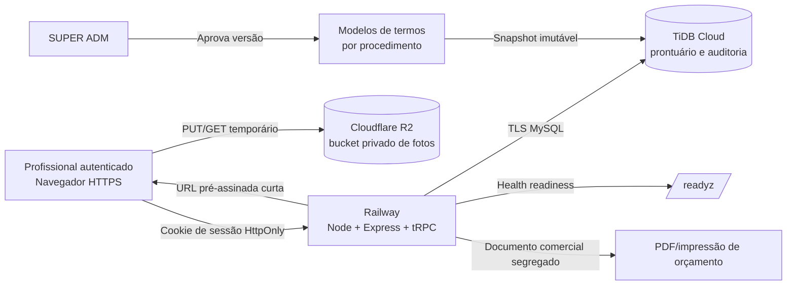

# Arquitetura detalhada — LUmina Skin Intelligence, prontuário futuro

**Autoria:** Manus AI
**Estado:** arquitetura de produção futura; código-base preparado, sem dados reais e sem implantação
**Arquitetura alvo:** Railway + Node.js/Express/tRPC + TiDB Cloud (MySQL) + Cloudflare R2 privado

## Conclusão arquitetural

A LUmina deve operar como uma aplicação clínica **independente de Manus**. O serviço web roda em contêiner no Railway. Os registros estruturados ficam no TiDB Cloud, com dialeto MySQL e Drizzle ORM. As fotos clínicas ficam em bucket Cloudflare R2 privado. O navegador não recebe credenciais do banco nem do bucket.

O desenho separa quatro domínios. O domínio clínico contém paciente, avaliação, evolução, foto e consentimento. O domínio comercial contém apenas orçamento e itens autorizados. O domínio administrativo contém usuários, papéis, atribuição de profissionais e catálogo. O domínio de governança contém auditoria, retenção, backups e incidentes. Essa separação evita que um orçamento carregue dados clínicos e evita que uma foto se torne arquivo público.

## Componentes e responsabilidades

| Camada | Componente | Responsabilidade | Não faz |
|---|---|---|---|
| Interface | React responsivo | Consulta, evolução, catálogo, orçamento e visualização de termos | Não mantém CPF, foto ou chave em armazenamento local persistente |
| API | Express + tRPC | Validação Zod, autorização, emissão de URLs temporárias e regras de negócio | Não expõe segredo R2 nem URL de banco |
| Sessão | JWT assinado + sessão persistida | Cookie `HttpOnly`, `SameSite=Strict`, expiração e revogação | Não confia apenas em token sem verificar sessão no banco |
| Dados clínicos | TiDB Cloud/MySQL | Pacientes, consentimentos, avaliações, evoluções e auditoria | Não fornece acesso direto ao navegador |
| Fotos | Cloudflare R2 privado | Objeto privado, URL pré-assinada por operação e checksum | Não usa domínio público ou `r2.dev` |
| Execução | Railway | Build de Dockerfile, variável privada, healthcheck e HTTPS | Não guarda backup como única fonte ou substitui o TiDB/R2 |

## Papéis e menor privilégio

A **SUPER ADM** administra catálogo, procedimentos, modelos de termos, aprovação de versões e atribuição de pacientes. A SUPER ADM tem escopo integral, pois é a responsável administrativa definida para a plataforma. O papel `admin` possui escopo integral somente se for criado e autorizado expressamente pela SUPER ADM. O papel `professional` só visualiza pacientes aos quais foi atribuído pela tabela `patient_assignments`; ao criar um paciente, ele recebe a atribuição inicial automaticamente.

O servidor aplica a verificação de paciente antes de avaliações, evoluções, fotos, consentimentos e orçamentos. A busca por nome de profissional retorna somente pacientes atribuídos. Uma expansão para unidades ou equipes deve acrescentar entidade organizacional e predicado de tenant antes de habilitar múltiplas clínicas. Não se deve pressupor que um único banco, por si só, forneça isolamento entre equipes.

## Dados e proteção aplicada

| Dado | Persistência | Proteção aplicada | Uso autorizado |
|---|---|---|---|
| Nome completo | TiDB em texto claro | Controle de papel, atribuição e auditoria | Identificação operacional do atendimento |
| CPF | TiDB cifrado com AES-256-GCM | Fingerprint HMAC derivado para deduplicação; não indexado em claro | Identificação e prevenção de duplicidade |
| Contato | TiDB cifrado com AES-256-GCM | Não é devolvido por busca de pacientes | Comunicação somente quando necessária |
| Avaliação e evolução | TiDB | Validação de entrada, papel, paciente atribuído e auditoria | Registro interno |
| Foto clínica | R2 privado | Consentimento ativo, URL temporária, tipo/tamanho/checksum e vínculo ao paciente | Registro de evolução autorizado |
| Orçamento | TiDB | Snapshot do nome e itens comerciais; emissão explícita | Documento comercial entregue ao cliente |
| Termo | TiDB | Versão, hash, snapshot renderizado, data/hora, paciente, procedimento e profissional | Evidência do aceite registrado |
| Auditoria | TiDB | Evento, autor, paciente, objeto e fingerprint de IP | Governança e investigação de acesso |

A chave de cifragem é distinta, por derivação HKDF, das chaves usadas para fingerprint de CPF e IP. A rotação futura deve preservar uma chave identificadora por versão e executar recriptografia controlada. Nenhuma chave entra no frontend, no Git ou em material de suporte.

## Fluxo de fotografia clínica

1. O profissional abre paciente que está em seu escopo.
2. O servidor confere consentimento clínico de imagem ativo.
3. O navegador calcula SHA-256 do arquivo e solicita autorização de upload com tipo e tamanho.
4. O backend gera uma URL pré-assinada R2 válida por cinco minutos e uma chave sob o prefixo do paciente.
5. O navegador envia o arquivo diretamente ao bucket privado, com `Content-Type` e checksum assinados.
6. O backend reserva o intent de modo exclusivo, revalida escopo, consentimento e vínculo de evolução, consulta metadata do objeto e confirma tipo, tamanho e checksum.
7. Em uma transação, grava metadata da foto, registra auditoria e consome o intent. Falhas liberam o intent; um ciclo futuro de limpeza remove objetos órfãos.

R2 é compatível com API S3 e oferece URLs pré-assinadas para operações específicas. Quem possui uma URL válida pode usar a operação até ela expirar; portanto, ela deve ser tratada como token temporário e nunca incluída em logs, analytics ou mensagens. [1] [2]

## Termo de consentimento personalizável por procedimento

O módulo não fornece cláusulas prontas. A titular cria o conteúdo, título, tipo e versão do termo. Cada modelo é associado a um procedimento específico. O modelo nasce como `draft` e só a SUPER ADM pode promovê-lo para `approved`. Versão aprovada não é editada; correções exigem novo modelo e nova versão.

O template aceita somente cinco marcadores controlados:

| Marcador | Preenchimento no momento do registro |
|---|---|
| `{{PACIENTE_NOME}}` | Nome completo do paciente selecionado |
| `{{PROCEDIMENTO_NOME}}` | Nome do procedimento associado ao termo |
| `{{DATA_REGISTRO}}` | Data do servidor no fuso configurado |
| `{{HORA_REGISTRO}}` | Hora do servidor no fuso configurado |
| `{{PROFISSIONAL_NOME}}` | Nome da conta autenticada que registrou o aceite |

No momento do aceite, o sistema produz um snapshot renderizado, registra hash do modelo aprovado, versão, pessoa que declarou o aceite, método de registro, data/hora do servidor e profissional coletor. O snapshot evita que edição posterior de um rascunho altere uma evidência já registrada. O sistema não deve alegar assinatura eletrônica avançada, certificado ou validade jurídica específica sem integrar e validar um provedor apropriado e a orientação jurídica aplicável.

## Separação clínico–comercial

O orçamento recebe apenas itens, quantidade, valor, desconto, validade, mensagem comercial e snapshot do nome completo. Procedimentos de catálogo têm valor e descrição revalidados no servidor; o frontend não pode impor preço de procedimento. Itens manuais são permitidos apenas conforme política comercial definida pela titular.

O orçamento só pode ser emitido uma vez a partir de `draft`. A consulta para impressão exige estado `issued`. A impressão escapa HTML e não recebe CPF, contato, foto, avaliação, evolução, red flags, produtos vinculados ou notas internas. Esta separação deve ter teste de regressão antes de qualquer publicação.

## Estratégia de implantação futura

O repositório fonte deve conter somente código, migrações MySQL novas, testes, documentação e configurações sem segredos. O Dockerfile executará build em contêiner. O Railway injeta `PORT` e a aplicação responde em `/readyz` apenas quando a configuração obrigatória estiver válida e o TiDB responder `SELECT 1`. A plataforma pode usar esse endpoint como healthcheck de readiness; um endpoint de liveness não prova banco ou configuração funcional. [3] [4]

Variáveis ficam exclusivamente no painel privado do Railway ou em cofre próprio da titular. As variáveis fundamentais são `DATABASE_URL`, `DATABASE_SSL`, `JWT_SECRET`, `DATA_ENCRYPTION_KEY`, `BOOTSTRAP_ADMIN_*`, `S3_ENDPOINT`, `S3_BUCKET`, `S3_ACCESS_KEY_ID`, `S3_SECRET_ACCESS_KEY` e `UPLOAD_MAX_BYTES`. O script `pnpm verify:config` valida presença e formato sem exibir valores.

A política de conteúdo do navegador permite apenas o próprio site e, para fotos, o origin HTTPS exato do endpoint R2 configurado. O bucket deve receber CORS de origens explícitas, nunca `*`. A configuração de CORS está em `R2_CORS_TEMPLATE.json` e só pode receber domínio definitivo após homologação.

## Migrações e entrada em produção

O histórico PostgreSQL legado foi removido da cópia independente. A primeira migração TiDB/MySQL deve ser **gerada a partir do schema atual em banco vazio de homologação**, revisada e testada antes de qualquer ambiente com dados. Não é seguro aplicar uma migração PostgreSQL em TiDB, nem executar migrations em cada réplica durante o boot.

A sequência futura é: criar TiDB e R2 próprios; gerar e revisar migração MySQL; aplicar somente no banco vazio de homologação; cadastrar variáveis privadas; executar testes com dados fictícios; testar CORS/CSP de foto; testar restauração; aprovar o primeiro deploy Railway; somente então migrar dados reais mediante procedimento local, autorizado e verificável. DNS e domínio permanecem fora deste escopo até aprovação escrita específica.

## Operação e manutenção anual

A manutenção não depende de conhecimento de código para atividades comuns. Catálogo e modelos de termos são editados no painel por SUPER ADM. A atribuição de profissionais deve ser revisada mensalmente. O ciclo técnico trimestral deve incluir atualização em homologação, teste de login, paciente fictício, termo fictício, foto fictícia, orçamento fictício e restauração de cópia de teste.

Backups devem ser criptografados, privados e testados por restauração. R2 deve ter política para objetos não confirmados e fotos excluídas ou vinculadas a consentimento revogado. A aplicação ainda precisa ganhar interface de revogação de termo, gestão completa de profissionais, consulta administrativa de auditoria, recuperação de senha por canal aprovado, observabilidade sem PII e rotina de reconciliação banco–R2. Esses itens são gates de entrada em produção, não tarefas cosméticas.

## Gates de prontidão

| Gate | Critério de aceite |
|---|---|
| Banco | Migração MySQL revisada e aplicada em TiDB de homologação; readiness responde 200 somente com banco disponível |
| Segredos | Variáveis privadas presentes, `verify:config` aprovado, nenhum valor em Git ou chat |
| Fotos | Bucket privado, CORS restrito, domínio público desligado, PUT/HEAD/GET temporário testados |
| Autorização | SUPER ADM testada; profissional não acessa paciente não atribuído |
| Termos | Rascunho, aprovação, preview e registro de snapshot testados com conteúdo fictício aprovado pela titular |
| Comercial | Orçamento emitido não contém dados clínicos e rejeita alteração de preço de procedimento pelo navegador |
| Recuperação | Backup e restauração de teste documentados e aprovados |
| Operação | Política de retenção, incidente, acesso e suporte interno definida pela titular e revisão jurídica/profissional concluída |

## Referências

[1]: https://developers.cloudflare.com/r2/api/s3/ "S3-compatible API · Cloudflare R2 documentation"
[2]: https://developers.cloudflare.com/r2/api/s3/presigned-urls/ "Presigned URLs · Cloudflare R2 documentation"
[3]: https://docs.railway.com/variables "Variables · Railway documentation"
[4]: https://docs.railway.com/deployments/healthchecks "Healthchecks · Railway documentation"
[5]: https://docs.pingcap.com/tidbcloud/connect-to-tidb-cluster/ "Connect to TiDB Cloud · PingCAP documentation"
