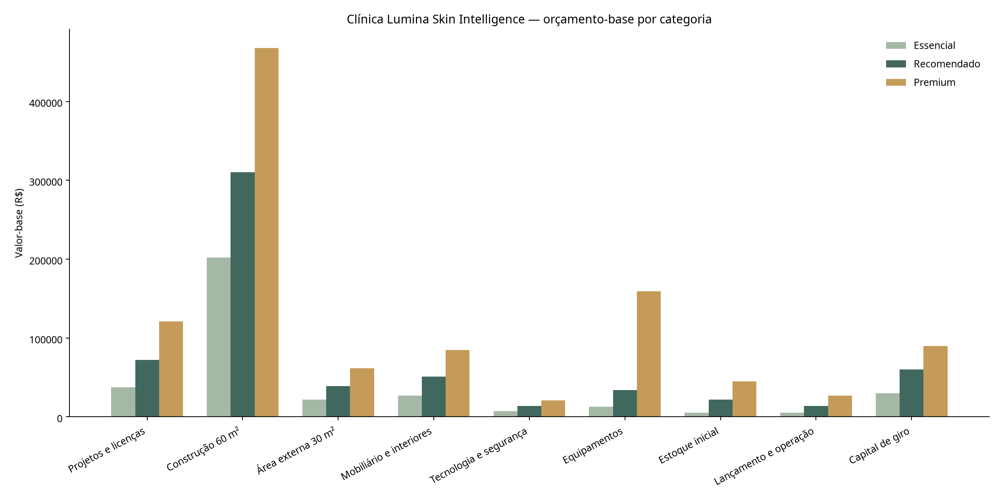

# Orçamento detalhado de implantação

**Clínica Lumina Skin Intelligence**  
**Base:** módulo novo de 60 m² + área externa drenante de 30 m²  
**Data-base:** agosto de 2026 | **Início físico:** maio de 2027

> Este orçamento é paramétrico porque cidade/UF, topografia, solo, conexão com a casa e cotações locais ainda não foram informados. A folga não é lucro do fornecedor: reúne reajuste até maio de 2027 e contingência técnica explícita. Antes de contratar, exigir no mínimo três propostas comparáveis e orçamento executivo do profissional local.

## Total geral com folga

| Cenário | Base sem capital de giro | Reajuste 5% | Contingência | Capital de giro | **Total geral** | Reserva mensal em 8 meses |
|---|---:|---:|---:|---:|---:|---:|
| Essencial | R$ 319.790,00 | R$ 15.989,50 | R$ 58.008,30 | R$ 30.000,00 | **R$ 423.787,80** | R$ 52.973,47 |
| Recomendado | R$ 555.889,00 | R$ 27.794,45 | R$ 112.318,35 | R$ 60.000,00 | **R$ 756.001,80** | R$ 94.500,22 |
| Premium | R$ 987.210,00 | R$ 49.360,50 | R$ 224.115,80 | R$ 90.000,00 | **R$ 1.350.686,30** | R$ 168.835,79 |

## Subtotais por categoria

| Categoria | Essencial | Recomendado | Premium |
|---|---:|---:|---:|
| Projetos e licenças | R$ 37.500,00 | R$ 72.000,00 | R$ 121.000,00 |
| Construção 60 m² | R$ 202.000,00 | R$ 310.500,00 | R$ 468.000,00 |
| Área externa 30 m² | R$ 22.000,00 | R$ 39.000,00 | R$ 61.500,00 |
| Mobiliário e interiores | R$ 26.950,00 | R$ 51.000,00 | R$ 84.650,00 |
| Tecnologia e segurança | R$ 7.500,00 | R$ 13.600,00 | R$ 20.800,00 |
| Equipamentos | R$ 12.840,00 | R$ 33.789,00 | R$ 159.260,00 |
| Estoque inicial | R$ 5.500,00 | R$ 22.000,00 | R$ 45.000,00 |
| Lançamento e operação | R$ 5.500,00 | R$ 14.000,00 | R$ 27.000,00 |
| Capital de giro | R$ 30.000,00 | R$ 60.000,00 | R$ 90.000,00 |

## Orçamento linha a linha

| Categoria | Item | Qtd. | Essencial | Recomendado | Premium | Fase |
|---|---|---:|---:|---:|---:|---|
| Projetos e licenças | Levantamento topográfico/cadastral e sondagem simplificada | 1 vb | R$ 3.500,00 | R$ 6.000,00 | R$ 9.000,00 | Antes da obra |
| Projetos e licenças | Projeto arquitetônico legal e executivo | 1 vb | R$ 12.000,00 | R$ 22.000,00 | R$ 35.000,00 | Antes da obra |
| Projetos e licenças | Projetos estrutural, elétrico, hidráulico, climatização e prevenção | 1 vb | R$ 8.000,00 | R$ 15.000,00 | R$ 25.000,00 | Antes da obra |
| Projetos e licenças | Aprovação sanitária, prefeitura, bombeiros e taxas | 1 vb | R$ 3.000,00 | R$ 7.000,00 | R$ 12.000,00 | Antes da obra |
| Projetos e licenças | PGRSS, POPs, documentação técnica e implantação LGPD | 1 vb | R$ 2.500,00 | R$ 5.000,00 | R$ 8.000,00 | Pré-operação |
| Projetos e licenças | Abertura, contabilidade, contratos e seguros iniciais | 1 vb | R$ 3.500,00 | R$ 7.000,00 | R$ 12.000,00 | Pré-operação |
| Projetos e licenças | Cursos complementares e treinamento de equipamentos | 1 vb | R$ 5.000,00 | R$ 10.000,00 | R$ 20.000,00 | 2026–2027 |
| Construção 60 m² | Canteiro, proteção da casa e instalações provisórias | 1 vb | R$ 6.000,00 | R$ 9.000,00 | R$ 14.000,00 | Obra |
| Construção 60 m² | Movimento de terra, fundações e impermeabilização de base | 1 vb | R$ 26.000,00 | R$ 38.000,00 | R$ 55.000,00 | Obra |
| Construção 60 m² | Estrutura, lajes/vergas e alvenarias | 1 vb | R$ 42.000,00 | R$ 58.000,00 | R$ 78.000,00 | Obra |
| Construção 60 m² | Cobertura, calhas, rufos e impermeabilização | 1 vb | R$ 18.000,00 | R$ 26.000,00 | R$ 38.000,00 | Obra |
| Construção 60 m² | Revestimentos de paredes e preparação de superfícies | 1 vb | R$ 12.000,00 | R$ 18.000,00 | R$ 26.000,00 | Obra |
| Construção 60 m² | Pisos, rodapés e revestimentos molhados | 60 m² | R$ 18.000,00 | R$ 30.000,00 | R$ 48.000,00 | Obra |
| Construção 60 m² | Portas, janelas, ferragens e vidros | 1 vb | R$ 12.000,00 | R$ 22.000,00 | R$ 36.000,00 | Obra |
| Construção 60 m² | Forros, pintura e acabamentos finais | 1 vb | R$ 14.000,00 | R$ 22.000,00 | R$ 34.000,00 | Obra |
| Construção 60 m² | Instalações hidráulicas, esgoto, louças e metais | 1 vb | R$ 14.000,00 | R$ 22.000,00 | R$ 35.000,00 | Obra |
| Construção 60 m² | Instalações elétricas, quadros, dados e aterramento | 1 vb | R$ 16.000,00 | R$ 26.000,00 | R$ 40.000,00 | Obra |
| Construção 60 m² | Climatização, renovação/exaustão e drenos | 1 vb | R$ 12.000,00 | R$ 18.000,00 | R$ 28.000,00 | Obra |
| Construção 60 m² | Sanitário acessível completo | 1 vb | R$ 7.000,00 | R$ 12.000,00 | R$ 20.000,00 | Obra |
| Construção 60 m² | Segurança, emergência e sinalização técnica | 1 vb | R$ 2.500,00 | R$ 5.000,00 | R$ 9.000,00 | Obra |
| Construção 60 m² | Testes, comissionamento, as built e limpeza pós-obra | 1 vb | R$ 2.500,00 | R$ 4.500,00 | R$ 7.000,00 | Entrega |
| Área externa 30 m² | Escavação, regularização e retirada de material | 1 vb | R$ 3.000,00 | R$ 5.000,00 | R$ 8.000,00 | Obra |
| Área externa 30 m² | Base granular drenante e geotêxtil | 1 vb | R$ 3.000,00 | R$ 5.500,00 | R$ 8.000,00 | Obra |
| Área externa 30 m² | Dreno linear, tubos e caixas de inspeção | 1 vb | R$ 3.500,00 | R$ 6.500,00 | R$ 10.000,00 | Obra |
| Área externa 30 m² | Rota acessível em piso permeável antiderrapante | 12.96 m² | R$ 2.500,00 | R$ 4.500,00 | R$ 7.000,00 | Obra |
| Área externa 30 m² | Grama sintética permeável 30–35 mm instalada | 19.44 m² | R$ 2.000,00 | R$ 3.500,00 | R$ 5.500,00 | Obra |
| Área externa 30 m² | Bordas, contenções e acabamentos | 1 vb | R$ 1.500,00 | R$ 2.500,00 | R$ 4.000,00 | Obra |
| Área externa 30 m² | Iluminação externa e paisagismo de baixa manutenção | 1 vb | R$ 1.500,00 | R$ 3.500,00 | R$ 7.000,00 | Final |
| Área externa 30 m² | Mão de obra especializada e testes de drenagem | 1 vb | R$ 5.000,00 | R$ 8.000,00 | R$ 12.000,00 | Obra |
| Mobiliário e interiores | Marcenaria clínica e área técnica | 1 vb | R$ 12.000,00 | R$ 22.000,00 | R$ 35.000,00 | Obra |
| Mobiliário e interiores | Maca elétrica 2 motores | 1 un | R$ 3.500,00 | R$ 5.500,00 | R$ 7.000,00 | Fase 1 |
| Mobiliário e interiores | Mocho sela ergonômico | 2 un | R$ 800,00 | R$ 1.200,00 | R$ 1.700,00 | Fase 1 |
| Mobiliário e interiores | Carrinhos auxiliares | 2 un | R$ 800,00 | R$ 1.200,00 | R$ 1.800,00 | Fase 1 |
| Mobiliário e interiores | Lupa luminária | 1 un | R$ 350,00 | R$ 600,00 | R$ 800,00 | Fase 1 |
| Mobiliário e interiores | Balcão acessível e mobiliário administrativo | 1 vb | R$ 4.000,00 | R$ 8.000,00 | R$ 14.000,00 | Obra |
| Mobiliário e interiores | Recepção completa para quatro pessoas | 1 vb | R$ 2.300,00 | R$ 5.000,00 | R$ 10.000,00 | Fase 1 |
| Mobiliário e interiores | Fotografia padronizada | 1 kit | R$ 1.000,00 | R$ 2.000,00 | R$ 3.350,00 | Fase 1 |
| Mobiliário e interiores | Comunicação visual, placas e decoração | 1 vb | R$ 1.200,00 | R$ 3.000,00 | R$ 6.000,00 | Final |
| Mobiliário e interiores | Apoio/copa e eletroportáteis | 1 vb | R$ 1.000,00 | R$ 2.500,00 | R$ 5.000,00 | Fase 1 |
| Tecnologia e segurança | Notebook administrativo | 1 un | R$ 3.000,00 | R$ 4.500,00 | R$ 5.500,00 | Fase 1 |
| Tecnologia e segurança | Impressora multifuncional | 1 un | R$ 900,00 | R$ 1.200,00 | R$ 1.800,00 | Fase 1 |
| Tecnologia e segurança | Impressora de etiquetas | 1 un | R$ 0,00 | R$ 700,00 | R$ 1.200,00 | Fase 1 |
| Tecnologia e segurança | Roteador, rede separada e nobreak | 1 kit | R$ 1.100,00 | R$ 1.700,00 | R$ 2.300,00 | Fase 1 |
| Tecnologia e segurança | Câmeras, alarme e controle de acesso | 1 kit | R$ 1.500,00 | R$ 3.000,00 | R$ 5.000,00 | Fase 1 |
| Tecnologia e segurança | Domínio, ferramentas e serviços digitais do primeiro ano | 1 vb | R$ 1.000,00 | R$ 2.500,00 | R$ 5.000,00 | Operação |
| Equipamentos | HIFU selecionado: Sonofocus / Ultrafocus / Ultramed | 1 un | R$ 8.091,00 | R$ 10.990,00 | R$ 106.656,00 | Fase 2 |
| Equipamentos | Fotobiomodulação: Laserpulse / Fluence / Antares | 1 un | R$ 1.980,00 | R$ 2.390,00 | R$ 4.474,00 | Fase 2 |
| Equipamentos | Limpeza de pele: alta frequência / Sonopeel / plataforma | 1 un | R$ 500,00 | R$ 3.300,00 | R$ 6.490,00 | Fase 1/2 |
| Equipamentos | Analisador de pele: portátil / intermediário / avançado | 1 un | R$ 269,00 | R$ 350,00 | R$ 5.000,00 | Fase 1/expansão |
| Equipamentos | Radiofrequência HTM Effect | 1 un | R$ 0,00 | R$ 0,00 | R$ 8.690,00 | Expansão |
| Equipamentos | Autoclave e seladora | 1 kit | R$ 0,00 | R$ 4.059,00 | R$ 8.500,00 | Condicional |
| Equipamentos | Câmara de conservação e monitoramento | 1 kit | R$ 0,00 | R$ 8.000,00 | R$ 9.650,00 | Condicional |
| Equipamentos | Sinais vitais e apoio clínico | 1 kit | R$ 500,00 | R$ 1.200,00 | R$ 1.800,00 | Fase 1 |
| Equipamentos | Manutenção, calibração e acessórios iniciais | 1 vb | R$ 1.500,00 | R$ 3.500,00 | R$ 8.000,00 | Fase 1/2 |
| Estoque inicial | Materiais gerais, EPIs e biossegurança | 1 vb | R$ 2.500,00 | R$ 4.500,00 | R$ 6.500,00 | Fase 1 |
| Estoque inicial | Linha profissional não invasiva | 1 vb | R$ 1.000,00 | R$ 2.500,00 | R$ 5.000,00 | Fase 1 |
| Estoque inicial | Consumíveis de aparelhos | 1 vb | R$ 500,00 | R$ 1.500,00 | R$ 3.000,00 | Fase 2 |
| Estoque inicial | Consumíveis de esterilização | 1 vb | R$ 0,00 | R$ 1.000,00 | R$ 2.500,00 | Condicional |
| Estoque inicial | Reserva para injetáveis piloto | 1 vb | R$ 0,00 | R$ 8.000,00 | R$ 20.000,00 | Após licença |
| Estoque inicial | Kit de emergência definido pelo RT | 1 vb | R$ 0,00 | R$ 2.000,00 | R$ 4.000,00 | Após licença |
| Estoque inicial | Materiais de limpeza e sanitário | 1 vb | R$ 1.000,00 | R$ 1.500,00 | R$ 2.500,00 | Fase 1 |
| Estoque inicial | Água, café e itens de recepção | 1 vb | R$ 500,00 | R$ 1.000,00 | R$ 1.500,00 | Fase 1 |
| Lançamento e operação | Identidade aplicada, inauguração e comunicação inicial | 1 vb | R$ 3.000,00 | R$ 8.000,00 | R$ 15.000,00 | Pré-abertura |
| Lançamento e operação | Contrato/coleta de resíduos e implantação | 1 vb | R$ 1.000,00 | R$ 2.500,00 | R$ 4.000,00 | Pré-abertura |
| Lançamento e operação | Contratos iniciais de manutenção e suporte | 1 vb | R$ 1.500,00 | R$ 3.500,00 | R$ 8.000,00 | Pré-abertura |
| Capital de giro | Reserva operacional de três meses | 1 vb | R$ 30.000,00 | R$ 60.000,00 | R$ 90.000,00 | Antes da abertura |

## Interpretação dos cenários

O cenário **Essencial** preserva estrutura e segurança, adia radiofrequência, cadeia fria e processamento interno e escolhe equipamentos de entrada. O cenário **Recomendado** é o orçamento-base com folga solicitado: inclui acabamento clínico consistente, Ultrafocus como referência HIFU, fotobiomodulação intermediária, reserva para cadeia fria e injetáveis sem antecipar a compra. O cenário **Premium** incorpora Ultramed HIFU, maior marcenaria, mais tecnologia e acabamentos superiores.

A reserva mensal pressupõe oito aportes entre setembro de 2026 e abril de 2027. Se a clínica já possuir parte do capital, o painel recalculará a meta como `(total − saldo atual) ÷ meses restantes`. Compra de equipamentos, cosméticos e injetáveis deve ocorrer perto do comissionamento para preservar garantia e validade.

## Fontes de calibração

O SINAPI nacional de maio de 2026 registrou R$ 1.953,08/m², sendo R$ 1.104,59 de materiais e R$ 848,49 de mão de obra.[1] O CUB R8-N sem desoneração de São Paulo foi R$ 2.231,37/m² em julho de 2026.[2] Esses indicadores não representam sozinhos uma clínica pronta: o orçamento adiciona instalações, acessibilidade, acabamento sanitário, projetos, equipamentos, mobiliário, documentação, contingência e capital de giro.

## Referências

[1]: https://agenciadenoticias.ibge.gov.br/agencia-noticias/2012-agencia-de-noticias/noticias/47106-custos-da-construcao-variam-0-36-em-maio-com-destaque-para-regiao-sul "IBGE — SINAPI maio de 2026"
[2]: https://sindusconsp.com.br/servicos/cub/ "SindusCon-SP — CUB julho de 2026"
